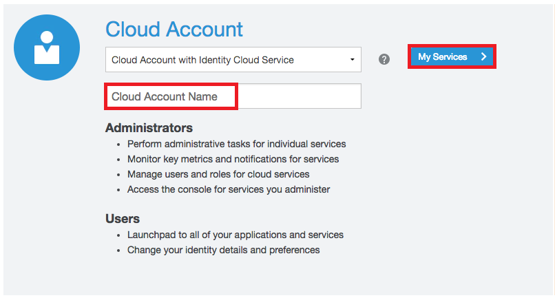

# Docker Workshop

 

Updated: June 21, 2018

## Overview

What is Docker? What is a container?

- Docker is the company and containerization technology.
- [Docker Documentation](https://docs.docker.com)
- A container is a runtime instance of a docker image: [Container Documentation](https://docs.docker.com/glossary/?term=container)

Containers have been around for many years. Docker created a technology that was usable by mere humans, and was much easier to understand than before. Thus, has enjoyed a tremendous amount of support for creating a technology for packaging applications to be portable and lightweight.

### VM vs Container


While containers may sound like a virtual machine (VM), the two are distinct technologies. With VMs each virtual machine includes the application, the necessary binaries and libraries and the entire guest operating system.

Whereas, Containers include the application, all of its dependencies, but share the kernel with other containers and are not tied to any specific infrastructure, other than having the Docker engine installed on it’s host – allowing containers to run on almost any computer, infrastructure and cloud.

**Note:** At this time, Windows and Linux containers require that they run on their respective kernel base, therefore, Windows containers cannot run on Linux hosts and vice versa.

## Introduction
In this lab we will obtain an Oracle Cloud Trial Account, create ssh key pairs, login into your Trial, create a VCN (Virtual Compute Network) and Compartment, create a new compute instance and finally install docker into the instance.

***To log issues***, click here to go to the [github oracle](https://github.com/oracle/learning-library/issues/new) repository issue submission form.

## Objectives

- Obtain an Oracle Cloud Trial Account
- Create a SSH key pair
- Create the baseline infrastructure to support a Compute instance
- SSH into the instance: Install Docker and GIT


## Required Artifacts

- If running from Windows: [Putty and PuttyGen](https://www.chiark.greenend.org.uk/~sgtatham/putty/latest.html)

# Get a Trial Account and Create Infrastructure

You will create all required infrastructure components within your Trail account.

## Obtain a Trial Account

### **Step 1**: Acquire an Oracle Cloud Trial Account

- If you do not have a trial account please click on this URL [cloud.oracle.com/tryit](http://cloud.oracle.com/tryit&intcmp=DeveloperInnovation-HOL-11NOV17), and complete all the required steps to get your free Oracle Cloud Trial Account.

- You will eventually receive the following email after your account has been provisioned:


### **STEP 2**: Log in to your OCI dashboard

- **You must wait until you receive this email above** indicating that your Cloud Account has been provisioned. _Please note that this email may arrive in your spam or promotions folder pending your email settings._

- Once you receive the **Get Started with Oracle Cloud** Email, make note of your **Username, Password and Cloud Account Name**.

  

- From any browser go to. :

    [https://cloud.oracle.com/en_US/sign-in](https://cloud.oracle.com/en_US/sign-in)

- Enter your **Cloud Account Name** in the input field and click the **My Services** button. If you have a trial account, this can be found in your welcome email. Otherwise, this will be supplied by your workshop instructor.

  

- Enter your **Username** and **Password** in the input fields and click **Sign In**.

  

**NOTE**: You may (probably) will be prompted to change the temporary password listed in the welcome email. In that case, enter the new password in the password field.

- In the top left corner of the dashboard, click the **hamburger menu**

  

- Click to expand the **Services** submenu, then click **Compute**

  

- On the OCI Console sign in page, enter the same **Username** as you did on the previous sign in page. If this is your first time logging into the OCI Console, enter the **temporary password** from your trial account welcome email. If you have already visited the OCI Console and changed your password, enter your **new password**.

  

### **STEP 3**: Create a Compartment

Compartments are used to isolate resources within your OCI tenant. User-based access policies can be applied to manage access to compute instances and other resources within a Compartment.

- Click the **hamburger icon** in the upper left corner to open the navigation menu. Under the **Identity** section of the menu, click **Compartments**

  

  

  - Click **Create Compartment**

    

  - In the **Name** field, enter `Demo`. Enter a **Description** of your choice. Click **Create Compartment**.

    

    

  - In a moment, your new Compartment will show up in the list. We will use it next to create components in.

    

### **STEP 4**: Create a Virtual Compute Network

We need a default VCN to define our networking within the Demo compartment. This is where Subnets and Security Lists, to name a couple get defined for each Availablity Domains in your Tenancy. Oracle Cloud Infrastructure is hosted in regions and availability domains. A region is a localized geographic area, and an availability domain is one or more data centers located within a region. A region is composed of several availability domains. Availability domains are isolated from each other, fault tolerant, and very unlikely to fail simultaneously. Because availability domains do not share infrastructure such as power or cooling, or the internal availability domain network, a failure at one availability domain is unlikely to impact the availability of the others.

All the availability domains in a region are connected to each other by a low latency, high bandwidth network, which makes it possible for you to provide high-availability connectivity to the Internet and customer premises, and to build replicated systems in multiple availability domains for both high-availability and disaster recovery.

- Click the **hamburger icon** in the upper left corner to open the navigation menu. Under the **Network** section of the menu, click **Virtual Cloud Networks**

    

- Click **Create Virtual Cloud Network**

    

- Fill in the follow values as highlighted below:

    **NOTE:** Make sure to de-select the "USE DNS HOSTNAMES IN THIS VCN" checkbox)

    

    

- Click **Create Virtual Cloud Network**

- Click **Close** on the details page:

    

- You will see:

    

### **STEP 5**: Add a Security List entry

A security list provides a virtual firewall for an instance, with ingress and egress rules that specify the types of traffic allowed in and out. Each security list is enforced at the instance level. However, you configure your security lists at the subnet level, which means that all instances in a given subnet are subject to the same set of rules. The security lists apply to a given instance whether it's talking with another instance in the VCN or a host outside the VCN.

- Click on the **DeickerVCN** and then **Security Lists**

    

    

- Click on **Default Security List for DockerVCN**

    

For the purposes of the upcoming Docker deployments we need to add three Ingress Rules that allow access from the Internet to ports 9080, 8002, and 8085. In the production environment only the UI port (8085) would typically be opened for access but the labs will have us test the various other Docker container functionallity as we go, thus the need to open three ports.

- Click **Edit All Rules** and then select **+Add Rule**

    

    

- **Enter the following**

**NOTE:** Leave all other values at default

```
Source CIDR: 0.0.0.0/0
Destination Port Range: 8085 
```

- **Add two more Ingress Rules**

```
Source CIDR: 0.0.0.0/0
Destination Port Range: 8085 
```

```
Source CIDR: 0.0.0.0/0
Destination Port Range: 8085 
```

- When completed your rules should look like:

    

- Click the **Save Secutiry List Rules** button

    

- Your Ingress Rules should look like:

    

### **STEP 6**: Create SSH Key Pair (Linux client)

Before we create the Compute instance that will contian Docker and application depoyments we need to create an ssh key pair so we'll be able to securly connect to the instance and do the Docker installation, etc.

**NOTE:** `This step focuses on key pair generation for Linux based terminal sessions. If your going to run your terminal sessions from a Windows client then skip to STEP 7`

- In the terminal window **Type** the following


- **Type** the following:

```
docker ps
```


### **STEP 4**: Run the restclient docker image from docker hub

We will now download and create a container based on an existing docker image stored in the Docker Hub. It uses a JSON formatted datafile to serve the test data via its exposed REST service. Docker looks for the designated image locally first before going to Docker HUB.

- Let's take a look at what the docker **run** command options do:
    - "-d" flag runs the container in the background
    - "-it" flags instructs Docker to allocate a pseudo-TTY connected to the
    container’s stdin, creating an interactive bash capable shell in the container (which we will use in a moment when we connect into the container)
    - "--rm" When this container is stopped all resources associated with it (storage, etc) will be deleted
    - "--name" The name of the container will be "restclient"
    - "-p" Port 8002 is mapped from the container to port 8002 on the HOST
    - "-e" Environment variables used by the application. "DS" setting designates the JSON datasource.

- **Type OR cut and paste** the following (all on one line):

``` 
docker run -d -it --rm --name restclient -p=8002:8002 -e DS='json' wvbirder/restclient
```


### **STEP 5**: Check running containers

Again using the `docker ps` command, we should see our newly spawned docker container

- **Type** the following:

```
docker ps
```

- Note that the container id is unique, and the container's port is mapped to 8002, which is the same as the Host's port.


### **STEP 6**: Check the Application with a browser

- Navigate in a browser to:

```
http://localhost:8002/
```


- Now enter this URL into your browser :  `http://localhost:8002/products`


### **STEP 7**: Stop the Container

- Since we started the `restclient` container with the --rm option upon stopping it docker will remove ALL allocated resources

- **Type** the following:

```
docker stop restclient
```

- Now, entering "docker ps -a" (which will show the status of ALL containers RUNNING or STOPPED) shows nothing proving the container was deleted upon stopping it.

- **Type** the following:

```
docker ps -a
```


### **STEP 8**: Start another Container with a different HOST Port

- Start another container using the Host's 18002 port:

- **Type** the following:

```
docker run -d -it --rm --name restclient -p=18002:8002 -e DS='json' wvbirder/restclient
```

- If you change your browsers port to 18002, you will see that the Host server is using 18002 and mapping that to our container's port 8002.


### **STEP 9**: Inspect the Container's Network and IP Address

- You can get various bits of information of the subnet that docker container is running on by inspecting the default network bridge docker creates out-of-the-box. You can create your own networks and assign containers to them but that is out of the scope of this lab. 

 - **Type** the following:

```
docker network inspect bridge
```

- This returns information about all the containers running on the default bridge. We see that our `restclient` container is assigned IP Address 172.17.0.1. You can ping that address from the Host server.


- Ping the `restclient` container IP Address: (in this example the IP was 172.17.0.2)

- **Type** the following:

```
ping 172.17.0.2
```


- Finally, **STOP** the `restclient` container as we will be re-using it in Lab 200 by **typing**:

```
docker stop restclient
```

**This completes the Lab!**
